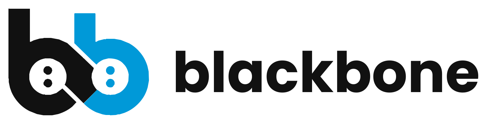

<p align="center">
  <picture>
    <source media="(prefers-color-scheme: dark)" srcset="docs/assets/blackbone-white.svg">
    <source media="(prefers-color-scheme: light)" srcset="docs/assets/blackbone-black.svg">
    
  </picture>
</p>

# BlackBone

**BlackBone** is a fork of [boneIO](https://boneio.eu) ([boneIO-eu/app_bbb](https://github.com/boneIO-eu/app_bbb)),
maintained by [smarthome-wroclaw](https://smarthome.wroclaw.pl). It adds features that
were missing in the original project, developed for and proven in real client installations.

> **smarthome-wroclaw is not affiliated with, endorsed by, or officially connected to the
> original boneIO authors.** BlackBone is released under the same GNU GPLv3 license as upstream.
>
> **Use at your own risk.** BlackBone is provided "as is", without warranty of any kind.
> smarthome-wroclaw accepts no liability for any damage or loss resulting from the use of this
> software.

## Example usage

```
boneio run -dd -c config.yaml
```

## Installation

```
sudo apt install -y libopenjp2-7-dev python3-venv libjpeg-dev docker-compose docker.io fonts-dejavu-core fonts-dejavu-extra libffi-dev libfreetype-dev libtiff6 libxcb1 mosquitto
mkdir ~/boneio
python3 -m venv ~/boneio/venv
source ~/boneio/venv/bin/activate
pip3 install --upgrade boneio
cp ~/venv/lib/python3.13/site-packages/boneio/example_config/*.yaml ~/boneio/
```

Edit `config.yaml`

### Start app

```
source ~/boneio/venv/bin/activate
boneio run -c ~/boneio/config.yaml -dd
```

```bash
sed -i 's/^- id:/- name:/' *.yaml
```

## Upgrading an existing controller to BlackBone

Already have a controller running the original boneIO app? [SSH into it](https://boneio.eu/docs/black/advanced/ssh-connection)
and run the BlackBone installer:

```bash
ssh <user>@<controller-ip>
curl -fsSL https://raw.githubusercontent.com/smarthome-wroclaw/blackbone/main/install.sh | bash
```

The installer is interactive: it auto-detects your existing virtual environment, offers to back
up your current configuration and installed app before touching anything, installs BlackBone,
and restarts the `boneio` service. Your existing config files are left in place.

## Contributing

Found a bug or have a feature you'd like to see? Issues and pull requests are welcome at
[smarthome-wroclaw/blackbone](https://github.com/smarthome-wroclaw/blackbone).

---

## Polski

**BlackBone** to fork [boneIO](https://boneio.eu) ([boneIO-eu/app_bbb](https://github.com/boneIO-eu/app_bbb)),
utrzymywany przez [smarthome-wroclaw](https://smarthome.wroclaw.pl). Dodaje funkcje,
których brakowało w oryginalnym projekcie, wypracowane i sprawdzone w realnych instalacjach u
klientów.

> **smarthome-wroclaw nie jest powiązane z autorami oryginalnej aplikacji boneIO ani przez nich
> wspierane.** BlackBone jest wydawane na tej samej licencji GNU GPLv3 co projekt źródłowy.
>
> **Używasz na własną odpowiedzialność.** BlackBone jest dostarczane w stanie „tak jak jest",
> bez żadnych gwarancji. smarthome-wroclaw nie ponosi odpowiedzialności za jakiekolwiek szkody
> lub straty wynikające z użytkowania tego oprogramowania.

### Przykład użycia

```
boneio run -dd -c config.yaml
```

### Instalacja

```
sudo apt install -y libopenjp2-7-dev python3-venv libjpeg-dev docker-compose docker.io fonts-dejavu-core fonts-dejavu-extra libffi-dev libfreetype-dev libtiff6 libxcb1 mosquitto
mkdir ~/boneio
python3 -m venv ~/boneio/venv
source ~/boneio/venv/bin/activate
pip3 install --upgrade boneio
cp ~/venv/lib/python3.13/site-packages/boneio/example_config/*.yaml ~/boneio/
```

Edytuj `config.yaml`

#### Uruchomienie aplikacji

```
source ~/boneio/venv/bin/activate
boneio run -c ~/boneio/config.yaml -dd
```

```bash
sed -i 's/^- id:/- name:/' *.yaml
```

### Aktualizacja istniejącego sterownika do BlackBone

Masz już sterownik z zainstalowaną oryginalną aplikacją boneIO? [Połącz się z nim przez SSH](https://boneio.eu/pl/docs/black/advanced/ssh-connection)
i uruchom instalator BlackBone:

```bash
ssh <user>@<adres-sterownika>
curl -fsSL https://raw.githubusercontent.com/smarthome-wroclaw/blackbone/main/install.sh | bash
```

Instalator działa interaktywnie: sam wykrywa istniejące środowisko wirtualne, proponuje kopię
zapasową aktualnej konfiguracji i zainstalowanej aplikacji zanim cokolwiek zmieni, instaluje
BlackBone i restartuje usługę `boneio`. Istniejące pliki konfiguracyjne pozostają nietknięte.

### Kontrybuowanie

Znalazłeś błąd albo masz pomysł na funkcję? Zgłoszenia (issues) i pull requesty są mile widziane
w repozytorium [smarthome-wroclaw/blackbone](https://github.com/smarthome-wroclaw/blackbone).
